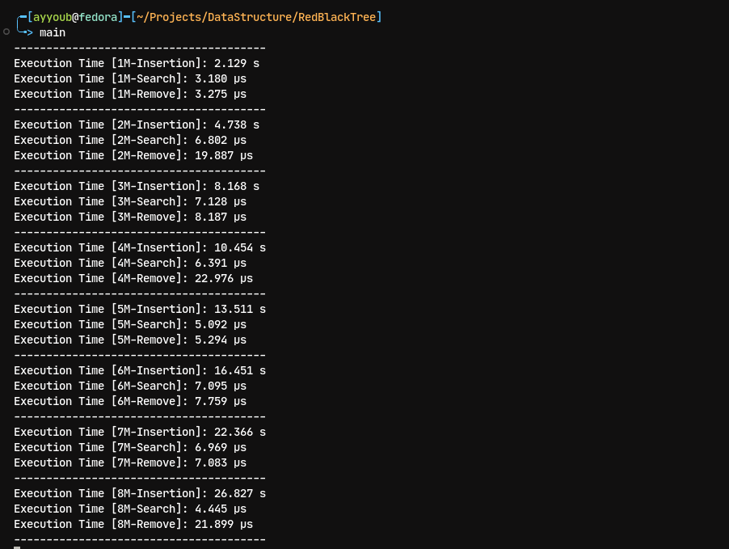

# Red-Black Tree Implementation

A high-performance, templated Red-Black Tree implementation in C++ with complete insertion, deletion, and search operations.

## Overview

This is a self-balancing binary search tree that maintains balance through node coloring (red or black) and rotations. Red-Black Trees guarantee O(log n) time complexity for all major operations, making them ideal for scenarios requiring consistent performance.

## Features

- **Template-based**: Works with any comparable data type
- **Self-balancing**: Automatically maintains tree balance after insertions and deletions
- **Efficient operations**: O(log n) time complexity for insert, delete, and search
- **Memory safe**: Proper cleanup with destructor and sentinel NIL node
- **Custom comparators**: Support for user-defined comparison functions

## Red-Black Tree Properties

1. Every node is either red or black
2. The root is always black
3. All NIL (leaf) nodes are black
4. Red nodes cannot have red children (no two consecutive red nodes on any path)
5. Every path from root to NIL contains the same number of black nodes

## API Reference

### Core Operations

```cpp
void insert(const T& value)        // Insert a value - O(log n)
bool remove(const T& value)        // Remove a value - O(log n)
bool contains(const T& value)      // Check if value exists - O(log n)
```

### Utility Operations

```cpp
bool isEmpty() const               // Check if tree is empty - O(1)
size_t size() const                // Get number of nodes - O(1)
void clear()                       // Remove all nodes - O(n)
void inorder(callback)             // Traverse in sorted order - O(n)
```

## Usage Example

```cpp
#include "RedBlackTree.hh"
#include <iostream>

int main() {
    RedBlackTree<int> tree;
    
    // Insert elements
    tree.insert(10);
    tree.insert(20);
    tree.insert(5);
    tree.insert(15);
    
    // Check existence
    if (tree.contains(10)) {
        std::cout << "Found 10" << std::endl;
    }
    
    // Remove element
    tree.remove(5);
    
    // Traverse in order
    tree.inorder([](const int& val) {
        std::cout << val << " ";
    });
    
    return 0;
}
```

## Performance Benchmarks

The following benchmarks were conducted on datasets of varying sizes to demonstrate the scalability and efficiency of the Red-Black Tree implementation.

### Performance Visualization



*Screenshot showing execution times for insert, search, and delete operations across different dataset sizes*

### Key Observations

- **Logarithmic scaling**: Operation times grow logarithmically with dataset size, confirming O(log n) complexity
- **Consistent performance**: All operations maintain predictable performance across different scales
- **Memory efficiency**: The tree uses a sentinel NIL node to minimize memory overhead

## Implementation Details

### Node Structure
Each node contains:
- `data`: The stored value
- `color`: RED or BLACK
- `parent`, `left`, `right`: Pointers to adjacent nodes

### Sentinel NIL Node
A single NIL sentinel node represents all leaf positions, reducing memory usage and simplifying edge case handling.

### Balancing Mechanism
The tree maintains balance through:
- **Rotations**: Left and right rotations restructure the tree
- **Recoloring**: Adjusting node colors to maintain Red-Black properties
- **Fixup procedures**: Specialized algorithms after insertion and deletion

## Compilation

```bash
g++ main.cpp -o main
```

## Testing

To run performance benchmarks:

```cpp
// Create test with 1M elements
RedBlackTree<int> tree;
auto start = std::chrono::high_resolution_clock::now();

for (int i = 0; i < 1000000; i++) {
    tree.insert(rand());
}

auto end = std::chrono::high_resolution_clock::now();
auto duration = std::chrono::duration_cast<std::chrono::milliseconds>(end - start);
std::cout << "Insertion time: " << duration.count() << " ms" << std::endl;
```

## Advantages Over Other Data Structures

| Feature | Red-Black Tree | AVL Tree | Hash Table |
|---------|---------------|----------|------------|
| Search  | O(log n)      | O(log n) | O(1) avg   |
| Insert  | O(log n)      | O(log n) | O(1) avg   |
| Delete  | O(log n)      | O(log n) | O(1) avg   |
| Ordered | Yes           | Yes      | No         |
| Worst case | O(log n)   | O(log n) | O(n)       |
| Rebalancing | Less frequent | More frequent | N/A |

Red-Black Trees are ideal when you need:
- Guaranteed O(log n) worst-case performance
- Ordered data traversal
- Fewer rebalancing operations than AVL trees

## License

Copyright (c) Ayyoub EL Kouri. All rights reserved.

---

*"Becoming an expert won't happen overnight, but with a bit of patience, you'll get there"*